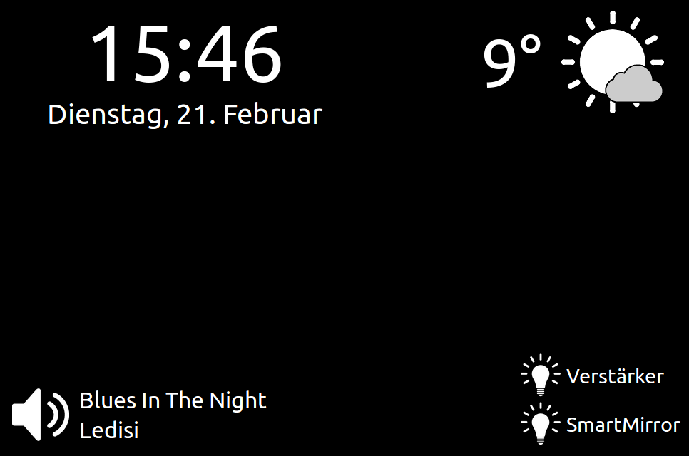

MagicMirror
=======================

This Magic Mirror or Smart Mirror is completely based on html, 
javascript and css. Everything you need is a browser.
This is a very minimalistic dashboard that shows the time, 
weather, music and switches. 
Time comes from the system time of the computer. 
To show weather information i use  http://api.openweathermap.org. 
Music and switch information comes from my smart home server 
based on this githup repo: https://github.com/dabastynator/RemoteControlSystem

